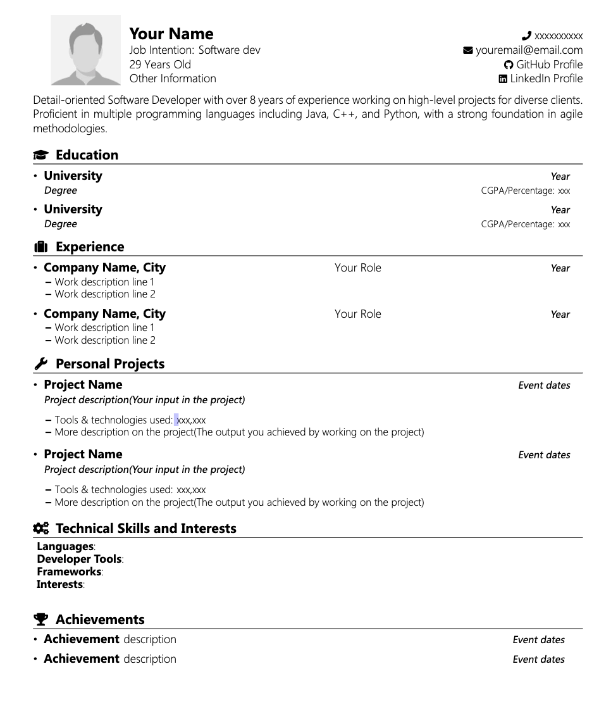

# Clean-LaTeX-Resume-Template-EN-CHINESE

## 1. Introduction

This project provides a clean LaTeX template for resumes. It is designed to be easy to use and customizable, providing a straightforward way for individuals to create a sleek and organized curriculum vitae。


## 2. Building the .tex File to Generate a PDF

To build the `.tex` file and generate a PDF document, follow these steps:

1. **Install LaTeX:** If you do not have LaTeX installed on your machine, download and install a LaTeX distribution from [here](https://www.latex-project.org/get/).
2. **Compile the .tex File:** Navigate to the directory containing the `.tex` file using a terminal. Once in the correct directory, run the following command:
```bash
pdflatex resume_template.tex
```
This will create a file called `resume_template.pdf` in the same directory.

Alternatively, you can use an online LaTeX editor like Overleaf to compile and download the PDF.

## 3. Screenshot

Below is a screenshot showcasing a resume created using this template:



## 4. Author Information

- Name: TeranceJY


## 5. References and Acknowledgments

This project was inspired by and built upon the following resources:

- [Resource 1](https://www.overleaf.com/latex/templates/nit-raipur-resume-template/qmwbrnftpsmh)

