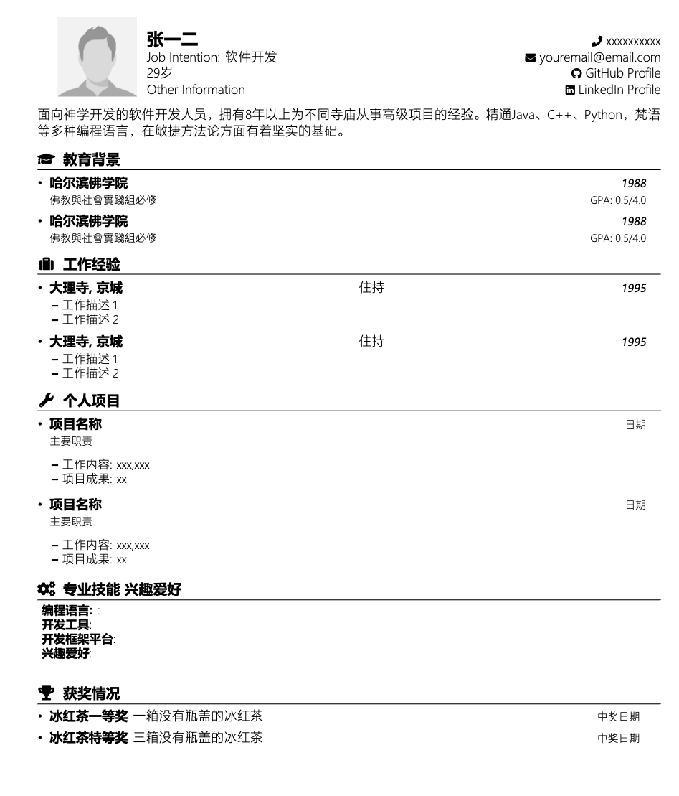

# LaTeX 简历模板

## 1. 简介

本项目提供了一个简洁的LaTeX简历模板。它设计成易于使用和定制，为个人提供了一个简单明了的方式来创建一个流畅且有组织的简历。

## 2. 编译 .tex 文件以生成 PDF

要编译 `.tex` 文件并生成 PDF 文档，请按照以下步骤操作：

1. **安装 LaTeX:** 如果您的计算机上没有安装 LaTeX，请从[这里](https://www.latex-project.org/get/)下载并安装 LaTeX 发行版。
2. **编译 .tex 文件:** 使用终端导航到包含 `.tex` 文件的目录。一旦进入正确的目录，运行以下命令：
```bash
pdflatex resume_template_chinese.tex
```
这将在同一目录中创建一个名为 `resume_template_chinese.pdf` 的文件。

或者，您可以使用像 Overleaf 这样的在线 LaTeX 编辑器来编译并下载 PDF。

## 3. 屏幕截图

下面是使用此模板创建的简历的屏幕截图：



## 4. 作者信息

- 名字: TeranceJY


如果您对此模板有任何问题或建议，请随时联系。

## 5. 引用和致谢

本项目的灵感来源于并建立在以下资源的基础上：

- [资源1](https://www.overleaf.com/latex/templates/nit-raipur-resume-template/qmwbrnftpsmh)
